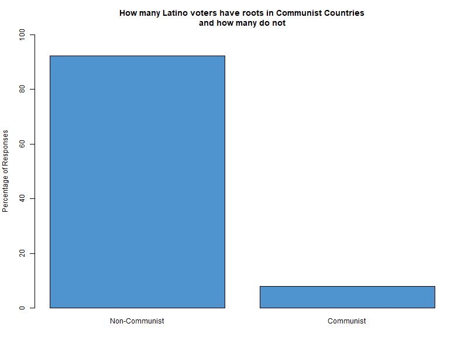
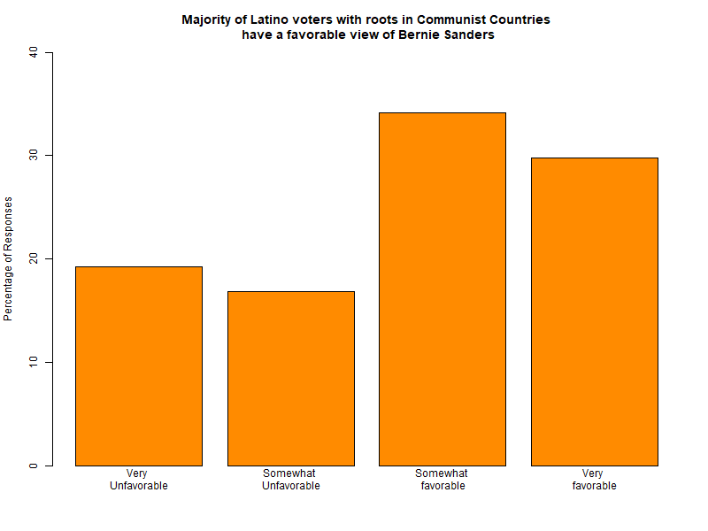
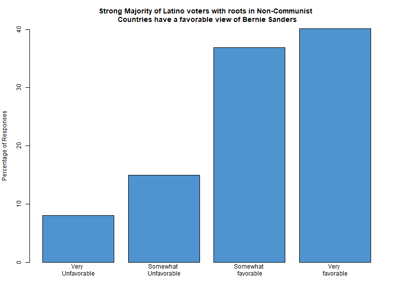
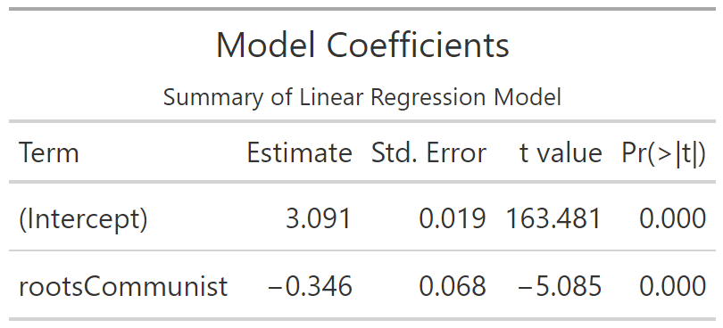
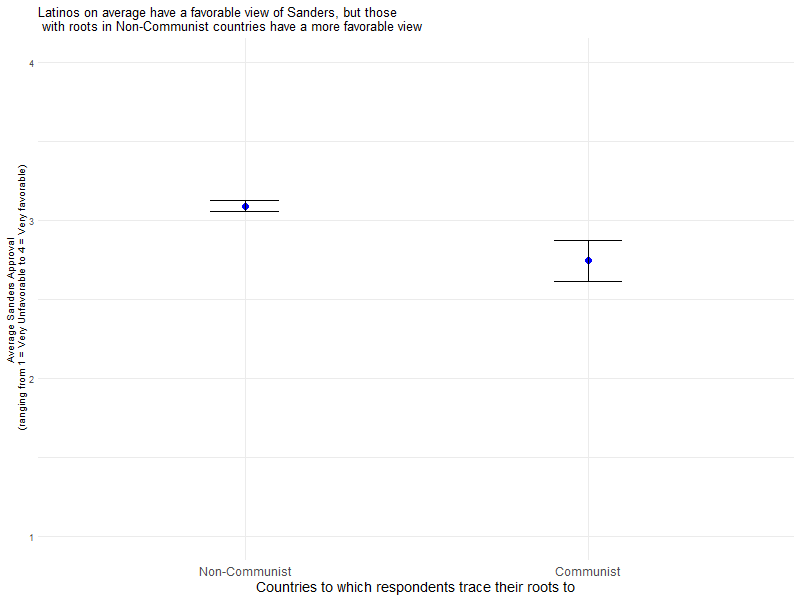
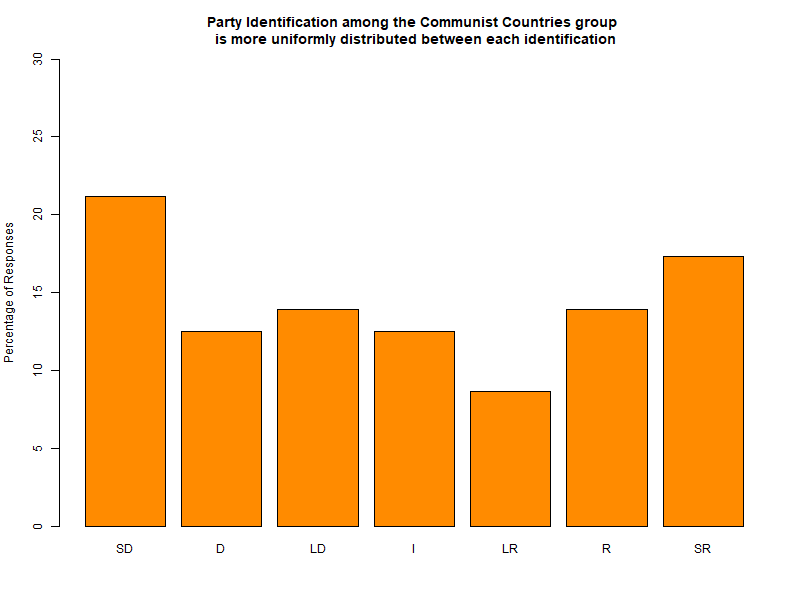
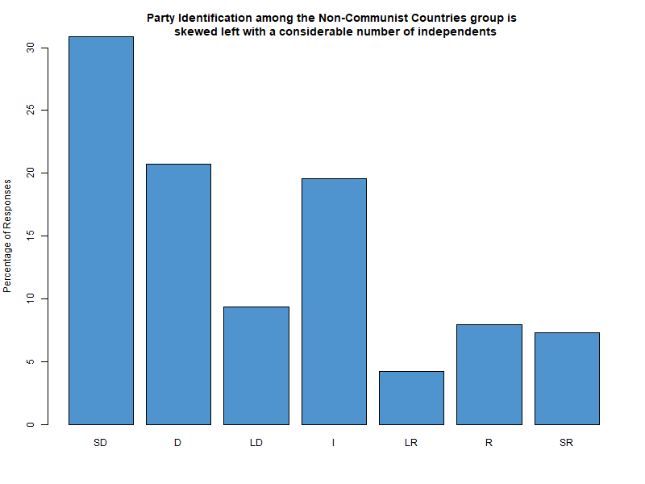
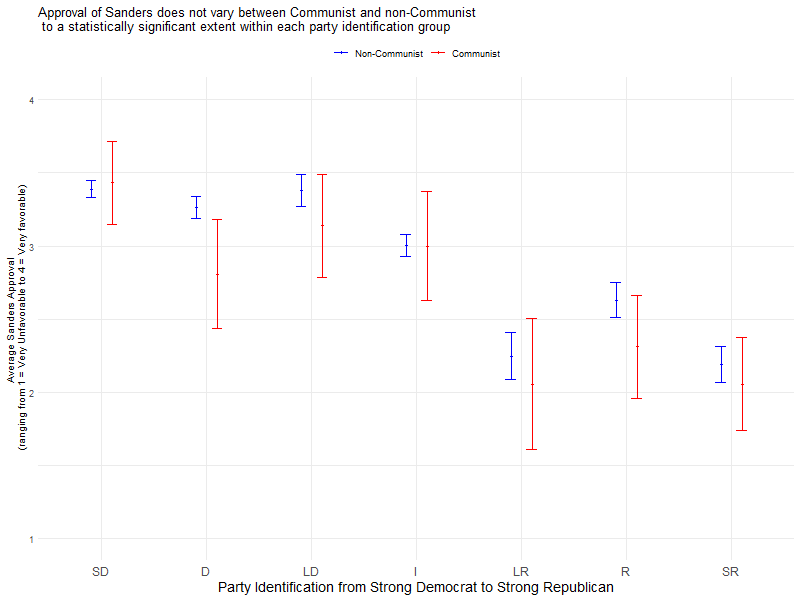
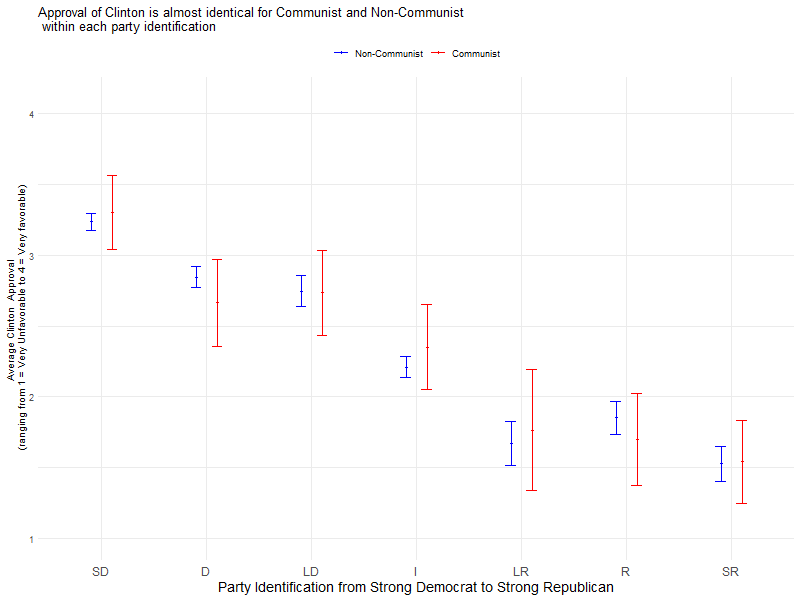
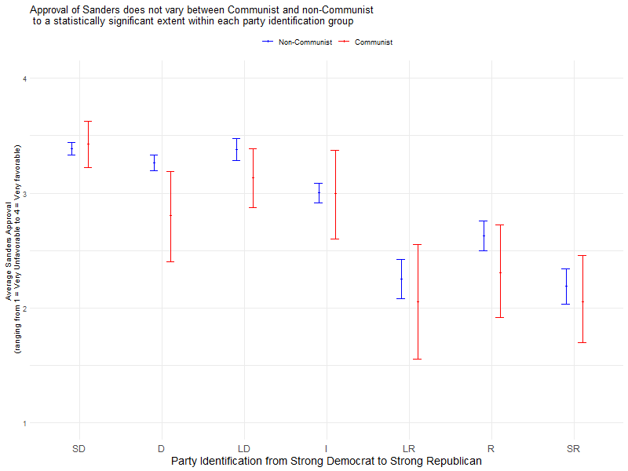

# Favorability of Socialist Candidates Among Latino Voters Who Trace Their Ancestry to Communist Countries

## Abstract:
This project seeks to determine if a socialist candidate is less popular among Latino Americans who trace their ancestry back to communist countries. We find that such Americans are less favorable of candidates running as “socialist” by looking at the favorability of Bernie Sanders among Latino Americans with different backgrounds.

## Introduction:

Some have argued that it is best to avoid running a candidate who accepts the label of “socialist as it may drive down turnout among Latino Americans who disapprove of socialism. This argument assumes that those who trace their ancestry back to Cuba, Venezuela, and Nicaragua, which have had a history of socialist government policies, will be less likely to support a socialist candidate.

## Data:

We can test this by looking at the [2016 Collaborative Multiracial Post-Election Survey data](https://doi.org/10.3886/ICPSR38040.v2) (CMPS), which asked Latino American respondents “To what country do you or your family trace your ancestry?”, resulting in over 3000 responses. Using this we can group together respondents that chose Cuba, Venezuela, and Nicaragua as our “communist-roots” group and all other Latino American respondents as our “non-communist-roots” group.

We can pair this with question asking if a respondent has a “favorable view or unfavorable view of Bernie Sanders”, who ran as a Democratic Socialist during the Democratic Presidential primary.

## Results

Using these two groups we can compare how favorability of Bernie Sanders differs for Latino Americans.

This shows that Sanders is more popular among Latinos who do not trace their ancestry to Cuba, Niceragua, and Venezuala. We can test the significance by running a regression

### Regression

While this data shows a statistically significant effect of having roots in communist countries, it misses the bigger picture that this could simply be a product of Cuban Americans that are more conservative than other Latin Americans. We can get around this by controlling for party affiliation of the respondents. Looking at party identification, going we can see that there much more strong democratic leaning Latino Americans with roots in non-communist countries.

### Controlling for Party Identification

If we use party identification data to predict the approal of Sanders, we can see that there is not enough data to determine that they are less popular among Latino Americans with roots in Communist or Socialist countries.

However, it can be useful to compare it to other candidates to see if there is any difference for other politicians.

Looking at Obama we can see that the difference in expected approval for each party identification is much closer to being the same for a non-socialist candidate than is the case for Bernie Sanders. It should be noted that although Sanders seems to be less popular than Obama among Latino Americans with roots in Non-Communist countries, they are still more popular than Hillary Clinton among Latinos, regardless of party affiliation or where they trace their ancestry too.

## Conclusion

While this data is insufficient to determine if there is a statistically significant difference between the approval of socialist candidates among Latino Americans who trace their ancestry to Cuba, Venezuala, and Nicaragua, and those who do not, it does show that it should be further investigated. 

By controlling for party affiliation, the difference in approval of the Democratic Socialist Candidate Bernie Sanders is insignificant, however, a larger sample size could narrow the confidence interval to provide clear results. Furthermore, since the survey did not control for age, it is possible that young Americans, who were more supportive of Bernie Sanders in 2016, but do not vote in high proportions made the data more mixed. Subsequent research could add age control or weigh each response by average voter turnout for that age group to make the predictions of favorability more significant and accurate.

It should be noted that while that even if the difference were statistically significant, it is possible for a Socialist Candidate like Bernie Sanders to poll higher with Latino Americans of any ancestry than a non-socialist candidate would. This is exemplified in the appendix by the fact that the average favorability of Sanders was higher for both groups and all party identifications than for Clinton.

## Appendix
### Clinton Favorability

The data suggests that although Hillary Clinton polls at roughly the same amount with Latinos from all poltical identity responses in contrast to Bernie Sanders, Sanders still has a higher average approval from all political party affiliations.

### Sanders Bootstrap Favorability

While bootstrapping does narrow the confidence interval, the findings are still statistically insignificant.
